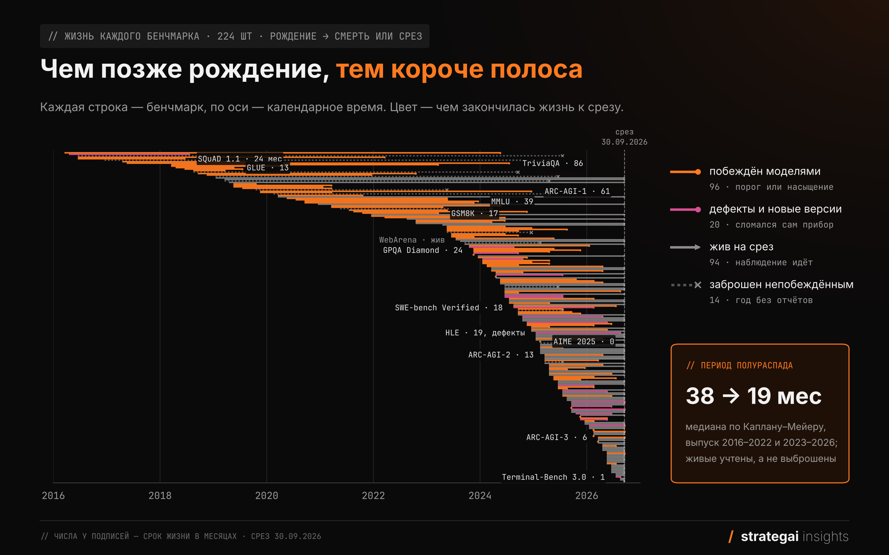
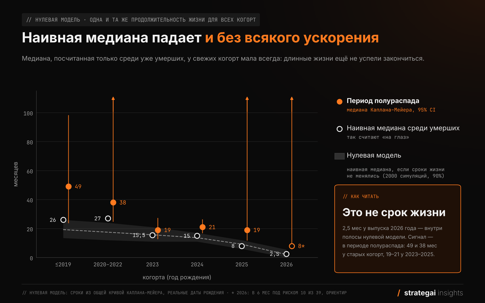
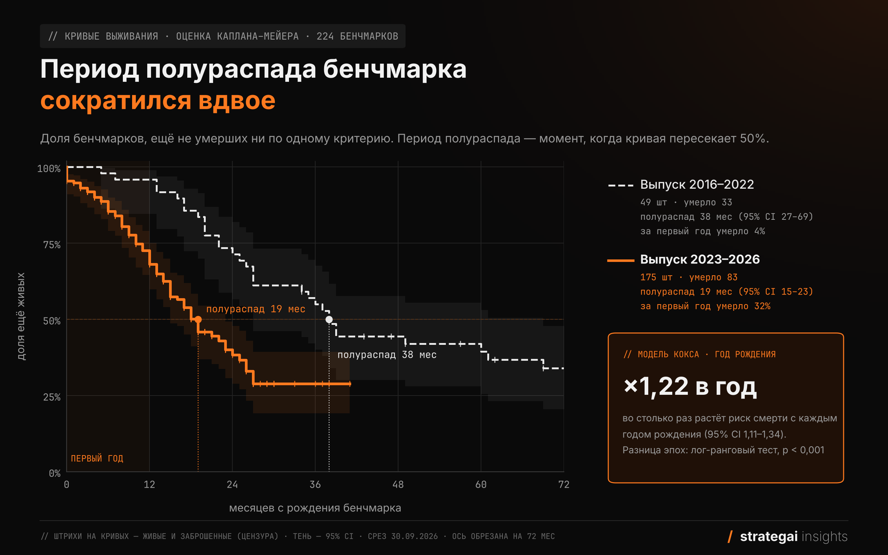
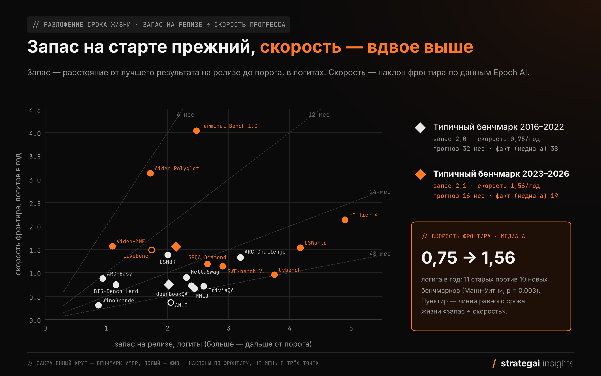
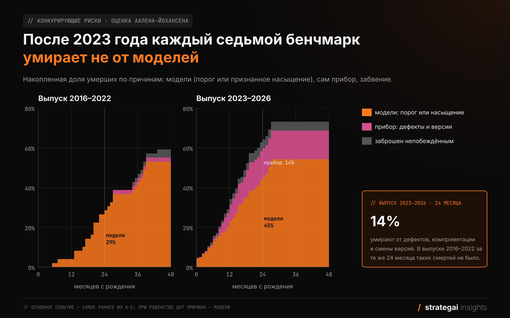
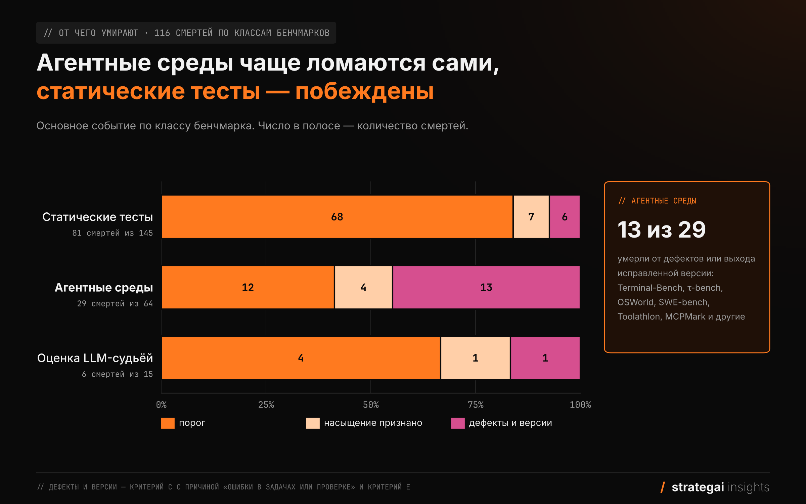
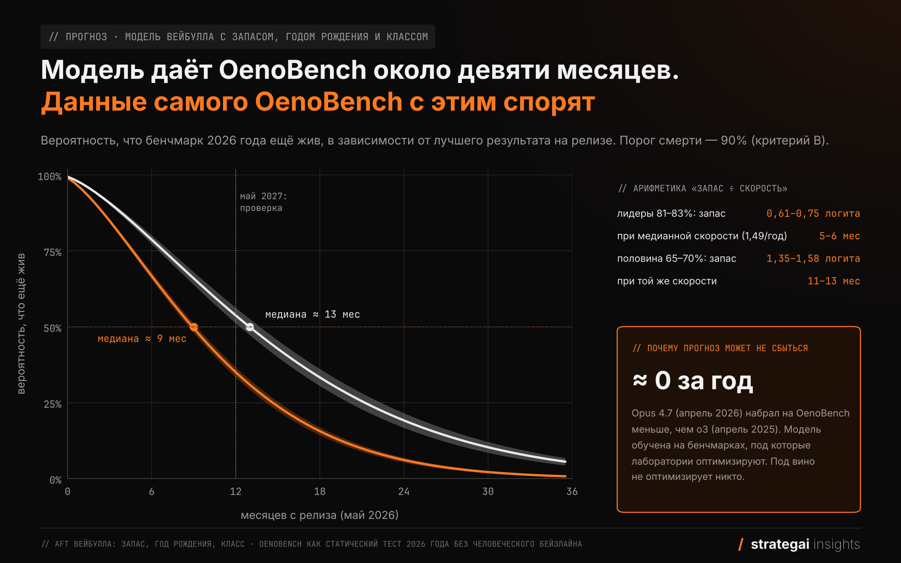

# Период полураспада бенчмарка ИИ сократился вдвое: 19 месяцев вместо 38

В мае я подал OenoBench, винный бенчмарк для языковых моделей, на NeurIPS. В дискуссии с ревьюерами всплыл вопрос, на который ни у меня, ни у них не было опоры: какой результат на релизе считать достаточным для нового бенчмарка и сколько он вообще проживёт.

Чтобы ответить, я собрал 224 бенчмарка, о которых в 2018–2026 годах отчитывались девять лабораторий: OpenAI, Anthropic, Google, Meta, xAI, DeepSeek, Alibaba, Moonshot и Mistral. Для каждого нашёл дату рождения и, если она уже наступила, дату смерти — момент, когда бенчмарк перестаёт различать лучшие модели: лидер набирает 90% или уровень человека, либо создатели сами признают набор насыщенным или сломанным. По этим датам считается период полураспада — срок, за который умирает половина бенчмарков.

Главные результаты:

- **Период полураспада бенчмарка — 23 месяца.** У вышедших до 2023 года он был 38 месяцев, у вышедших позже — 19. Оценка учитывает и ещё живые бенчмарки, поэтому короткая история новых её не искажает.
- **Новые бенчмарки не проще старых, просто модели быстрее.** Запас до потолка на старте у них прежний, а проходят его модели вдвое быстрее.
- **Каждый седьмой новый бенчмарк умирает не от моделей, а от собственных дефектов.** У агентных сред это причина почти половины смертей.

Ниже — как я считал и сколько, по этим данным, проживёт сам OenoBench. Датасет, кодбук и скрипты — в открытом доступе, ссылки в конце.



## Вопрос, на который не было опоры

OenoBench — это 3 266 вопросов о вине с выбором ответа, собранных из 38 104 фактов. На них я прогнал шестнадцать конфигураций моделей. Четвёрка лидеров (o3, GPT-5, Gemini 2.5 Pro и Opus 4.7) уложилась в 2,6 п. п., у лучшей — около 83%. На половине вопросов, которые не требуют рассуждений (closed-book solvable), лидеры набирают 96–97%, на второй половине — 65–70%. Много это или мало для нового бенчмарка? Спорить о планке, не зная, сколько живёт сам прибор, оказалось бессмысленно: непонятно, сколько месяцев покупает каждый процент запаса.

Ощущение, что бенчмарки умирают всё быстрее, есть у всех, кто следит за полем. Обычно его иллюстрируют кривыми из статьи о Dynabench (Kiela et al., 2021): шесть бенчмарков от MNIST до GLUE, путь каждого от релиза до человеческого уровня, и чем новее бенчмарк, тем круче кривая. Ott et al. (Nature Communications, 2022) разобрали 3 765 бенчмарков из Papers with Code и разделили их траектории на рост, насыщение и рывок после застоя. В Epoch AI сшили несколько десятков бенчмарков в единую шкалу способностей и начали статью с фразы «Most AI benchmarks saturate within years or even months after they are introduced» (Ho et al., 2025). Коалиция EvalEval в начале 2026 года посчитала индекс насыщения для 60 LLM-бенчмарков: почти половина насыщена, реже — большие тесты и наборы с экспертной курацией, а закрытый тестовый сплит не помогает (Akhtar et al., 2026).

Но на вопрос ревьюеров эти работы не отвечают: Dynabench и Ott показывают форму кривых, Epoch — прогресс моделей, EvalEval — насыщенность на одну дату. Мне нужно было знать, сколько бенчмарки живут с учётом тех, кто ещё жив, от чего умирают и сколько месяцев даёт запас на старте. Это обычная задача анализа выживаемости.

## Как умирает бенчмарк

Сначала нужно было договориться с собой, что считать смертью. Здесь первая ловушка: правила, которые придумываешь по ходу дела, незаметно подстраиваются под данные. Поэтому я записал их в кодбук до начала разметки. Смерть — самое раннее из пяти событий:

| Код | Событие | Когда применяется |
| --- | --- | --- |
| A | Лучший засчитанный результат ≥ человеческого бейзлайна | бейзлайн ≥ 85% шкалы, измерен людьми на том же сплите по описанному протоколу |
| B | Лучший засчитанный результат ≥ 90% основной метрики | бейзлайна нет или он ниже 85% |
| C | Мейнтейнер отозвал набор, заморозил приём, объявил его устаревшим или назвал насыщение либо дефекты причиной замены | только по публичному заявлению самих создателей |
| D | Достигнут порог, объявленный организаторами | например, 85% у ARC Prize, с проверкой организаторами |
| E | Независимая компрометация | утечка ответов к большинству фронтир-моделей; тривиальный метод выходит к потолку; аудит находит ≥ 20% дефектных задач, и хотя бы одна лаборатория из девяти после этого перестаёт отчитываться |

Есть ещё три исхода. Бенчмарк, о котором двенадцать месяцев никто не отчитывается и на лидерборде которого ничего не происходит, я считаю заброшенным: он не умер, а выбыл из наблюдения. Рождённый мёртвым — тот, у которого порог взят уже на релизе. И, наконец, живой: к 30 сентября 2026 года с ним ничего не случилось.

Засчитываю любую публично заявленную систему: голую модель, модель в обвязке или агент, ансамбль, если результат принял официальный лидерборд или разработчик опубликовал его с описанием протокола. Самоотчёты лабораторий тоже идут в зачёт. Для моего вопроса важно только, различает ли бенчмарк ещё лучшие модели, а каким способом взят порог — дело второе. Исключение — результаты с инструментами там, где протокол бенчмарка их не допускает (AIME, GPQA, HLE, MMLU): их я не засчитываю. Датой смерти считается день публикации результата.

Как это выглядит на знакомых бенчмарках:

- **GPQA Diamond** вышел в ноябре 2023 года и умер по критерию B через 24 месяца, когда Gemini 3 Pro набрала 91,9%.
- **MMLU** тоже умер по B. «Экспертный уровень 89,8%» из исходной статьи — оценка по 95-му перцентилю людей, сдававших исходные экзамены, а не результат людей на задачах MMLU, поэтому критерий A здесь не работает. Gemini Ultra набрала 90,04% в декабре 2023 года, через 39 месяцев после выхода бенчмарка.
- **ARC-AGI-2** умер по D: ARC Prize объявил цель 85%, и в апреле 2026 года GPT-5.5 показал ровно 85,0% в проверенном зачёте. Бенчмарк прожил 13 месяцев.
- **Humanity's Last Exam** до 90% не дожил: лучший результат без инструментов к срезу — около 61%. Его убил аудит. Команда Qwen разобрала все 2 500 вопросов и оставила без правок только 668, ещё 1 143 исправила, а по 689 не смогла вынести вердикт. В августе 2026 года Google перешёл на проверенное подмножество, и HLE умер по критерию E через 19 месяцев после выхода.
- **Terminal-Bench 3.0** прожил месяц. Мейнтейнеры выпустили 4.0, убрали 8 задач из 74 и перекалибровали ресурсы. Если заменено больше 10% задач или поменялся протокол, я считаю это новым бенчмарком, а старую версию — умершей по критерию C.

Последнее правило самое спорное, поэтому ниже я отдельно покажу, что будет, если новую версию считать не смертью, а выбытием из наблюдения.

## Кого я считал

Вторая ловушка — выборка. В прошлых версиях этого исследования я отбирал «флагманские» бенчмарки руками, и это ровно то, что ломает анализ выживаемости: в выборку попадают прославившиеся, а среди старых бенчмарков прославились в основном долгожители.

Поэтому теперь выборку задаёт правило. Бенчмарк попадает в неё, если о нём отчитались в официальных материалах релиза модели (блог, карточка, system card, техотчёт) хотя бы две лаборатории из девяти или одна лаборатория хотя бы в трёх релизах. Для лет до 2023-го источниками служили статьи о моделях, от GPT-1 и BERT до PaLM и Flan-PaLM. Всего получилось 230 релизов и 6 652 строки вида «релиз × бенчмарк × результат». Бенчмарк считается с точностью до версии, года экзамена или домена: SWE-bench, SWE-bench Verified и SWE-bench Pro — три разных бенчмарка, как и AIME 2024, 2025 и 2026.

Бенчмарками я не считал рейтинги без потолка вроде Elo-арен и перплексии, внутренние оценки лабораторий без публичных задач и поведенческие оценки (отказы, честность), у которых нет правильного ответа, только норма. Не вошли и сборники вроде BIG-bench, речь, перевод и батареи экзаменов. В итоге осталось 224 бенчмарка. Для каждого в датасете есть даты всех событий со ссылками на источники и цитатами. Так выглядит одна строка, сокращённо:

```json
{
  "unit": "Humanity's Last Exam",
  "release": "2025-01",
  "criterion_ab": "B", "threshold": "90", "ab_date": "",
  "e_date": "2026-08", "e_type": "iii",
  "e_source": "Аудит: arXiv 2602.13964 (HLE-Verified, Qwen Team, 2026-02); первый отказ лаборатории: Google, методология Gemini 3.7 Flash (2026-08-13)",
  "e_quote": "Gold 668 | Fully validated, no modification required; Revision 1,143 | Corrected ... and re-verified; Uncertain 689 | Validity cannot be conclusively determined",
  "primary_date": "2026-08", "primary_criterion": "E", "cause": "defects",
  "T_months": 19,
  "best_by_cutoff": "No tools: 60.9 (2026-09-01, self-report)"
}
```

Выборка получилась молодой: 175 бенчмарков из 224 вышли в 2023 году или позже, и многие из них ещё живы.

| Год выхода | Бенчмарков | Умерло | Живы | Заброшены |
| --- | --- | --- | --- | --- |
| 2016–2019 | 28 | 19 | 3 | 6 |
| 2020–2022 | 21 | 14 | 5 | 2 |
| 2023 | 23 | 16 | 5 | 2 |
| 2024 | 50 | 30 | 18 | 2 |
| 2025 | 63 | 27 | 34 | 2 |
| 2026 | 39 | 10 | 29 | 0 |

Отсюда главная сложность всей работы: по свежим годам простые средние ничего не говорят.

## Почему наивная медиана врёт

Самый распространённый способ посчитать срок жизни бенчмарков — взять умершие, сгруппировать по году выхода и посчитать медиану. На моих данных получается эффектная картина:

| Год выхода | 2016–2019 | 2020–2022 | 2023 | 2024 | 2025 | 2026 |
| --- | --- | --- | --- | --- | --- | --- |
| Медиана среди умерших, мес | 26 | 27 | 15,5 | 15 | 8 | 2,5 |

С двух с лишним лет до двух с половиной месяцев, ускорение больше чем в десять раз. Заголовок пишется сам. Но бенчмарк, вышедший в 2026 году, к 30 сентября не мог прожить больше восьми месяцев. Из его ровесников успели умереть только короткоживущие, длинные жизни ещё не закончились. Поэтому у молодых когорт медиана по умершим будет маленькой, как бы медленно бенчмарки ни умирали на самом деле.

Чтобы понять, сколько в этом падении настоящего ускорения, а сколько эффекта короткого наблюдения, я построил нулевую модель — мир, в котором сроки жизни бенчмарков не меняются никогда. Для каждой настоящей даты рождения из выборки разыгрываю срок жизни из общего распределения, обрезаю наблюдение на 30 сентября 2026 года и считаю ту же медиану. И так 2 000 раз.



Даже в мире без всякого ускорения медиана по умершим падает с 19 месяцев у старых когорт до двух у самой свежей. Наблюдаемые 8 и 2,5 месяца у бенчмарков 2025 и 2026 годов лежат внутри полосы нулевой модели, так что по свежим когортам такая статистика не говорит ничего. Настоящий сигнал виден на другом конце: у старых когорт медиана по умершим оказалась на верхней границе полосы и выше неё. Старые бенчмарки действительно жили дольше. Чтобы измерить это честно, нужна оценка, которая учитывает живых.

## Период полураспада: 23 месяца и разрыв вдвое

Период полураспада я считаю оценкой Каплана–Мейера: живые бенчмарки входят в неё как цензурированные наблюдения, заброшенные — так же, на дату последней активности. На lifelines это несколько строк:

```python
import pandas as pd
from lifelines import KaplanMeierFitter, CoxPHFitter

d = pd.read_csv("halflife_dataset_v3.csv")
m = d[d.stratum == "main"]                      # 224 бенчмарка
km = KaplanMeierFitter().fit(m.T_months, m.event)
print(km.median_survival_time_)                 # 23.0

for era, g in m.groupby(m.birth_year <= 2022):
    k = KaplanMeierFitter().fit(g.T_months, g.event)
    print("≤2022" if era else "2023+", k.median_survival_time_)   # 2023+ 19.0, ≤2022 38.0

x = m[["T_months", "event"]].assign(year=m.birth_year - 2023)
print(CoxPHFitter().fit(x, "T_months", "event").hazard_ratios_)  # year ≈ 1.22
```

По всей выборке период полураспада — 23 месяца (95% CI 19–27). Четверть бенчмарков умирает в первый же год, к двум годам в живых остаётся меньше половины.



Между эпохами разница вдвое. У бенчмарков, вышедших в 2016–2022 годах, период полураспада — 38 месяцев (95% CI 27–69), и за первый год из них умирало 4%. У вышедших в 2023 году и позже — 19 месяцев (15–23), а в первый год умирает уже около трети. С каждым следующим годом выхода риск смерти растёт примерно на 22%. Для типичного публичного статического теста это значит: вышедший в 2018 году прожил бы около 53 месяцев, в 2022-м — 31, в 2026-м — 18.

| Год выхода | Бенчмарков | Умерло | Период полураспада, мес (95% CI) |
| --- | --- | --- | --- |
| 2016–2019 | 28 | 19 | 49 (24–98) |
| 2020–2022 | 21 | 14 | 38 (25 и выше) |
| 2023 | 23 | 16 | 19 (13–27) |
| 2024 | 50 | 30 | 21 (17–26) |
| 2025 | 63 | 27 | 19 (12 и выше) |
| 2026 | 39 | 10 | — |

У бенчмарков 2026 года история пока слишком короткая для оценки: полгода наблюдений набралось только у 10 из 39.

Разрыв держится и при более строгих правилах. Если засчитывать только независимо проверенные результаты одиночных моделей, периоды полураспада вырастают до 68 и 26 месяцев, и разница между эпохами становится даже больше.

## Новые бенчмарки не легче, просто модели быстрее

Первое возражение напрашивается само: может, новые бенчмарки просто рождаются ближе к потолку? Лаборатории выпускают тесты, на которых их модели уже выглядят хорошо, создатели торопятся и не успевают сделать набор трудным.

Это можно проверить. Для 203 бенчмарков известен лучший результат на релизе, и по нему считается запас до порога. Я считаю его в логитах, потому что подняться с 50% до 60% и с 80% до 90% — задачи разной сложности, а в логитах траектория фронтира почти прямая. Медианный запас у старых бенчмарков — 2,02 логита, у новых — 2,14, или 35 и 38 процентных пунктов до порога. Новые бенчмарки стартуют даже чуть дальше от потолка, чем старые.

Скорость я взял из независимого источника. У Epoch AI для 21 бенчмарка из моей выборки есть траектории фронтира. На старых бенчмарках фронтир рос на 0,75 логита в год, на новых — на 1,56, то есть вдвое быстрее. Если поделить запас на скорость, типичный старый бенчмарк должен был прожить около 32 месяцев, новый — около 16. Фактически они прожили 38 и 19.



На отдельных бенчмарках этот расчёт грубее, но тоже работает. Модель выживаемости с запасом и годом выхода показывает то же самое: каждый лишний логит запаса удлиняет жизнь примерно в полтора раза, а при равном запасе более новый бенчмарк всё равно живёт меньше. Путь до потолка прежний, модели просто проходят его быстрее.

Крайний случай — бенчмарки, рождённые мёртвыми. Все ежегодные математические соревнования последних двух лет — AIME 2025 и 2026, HMMT Feb 2026 и Nov 2025, USAMO 2026 — модели решали на 90% и выше в том же месяце, когда прошло соревнование: MathArena и сами лаборатории прогоняют модели сразу после экзамена. Needle-in-a-Haystack вышел в ноябре 2023 года сразу с результатом GPT-4-128K выше 90%, OmniDocBench 1.5 — вместе с моделью MinerU2.5 той же лаборатории, набравшей 90,67.

## От чего умирают бенчмарки

Из 116 смертей 84 — это порог, взятый моделями. Ещё 12 раз создатели сами объявили бенчмарк насыщенным раньше, чем модели дошли до порога: так закончились GLUE, SQuAD 1.1, HealthBench, Video-MME и OSWorld-Verified. Планка у создателей бывает очень разной: Vals AI объявила первую версию Finance Agent насыщенной, когда лучший результат был 60,7%. Оставшиеся 20 смертей — дефекты. Создатели признали ошибки в задачах или проверке и выпустили исправленную версию, либо набор скомпрометировал независимый аудит или тривиальный метод.

Причины смерти конкурируют между собой: бенчмарк, умерший от дефектов, уже не умрёт от моделей. Поэтому доли я считаю оценкой Аалена–Йохансена.



За первые два года жизни среди бенчмарков 2016–2022 годов от моделей умирали 29%, от дефектов — ни один. Среди вышедших в 2023 году и позже от моделей умирают 45%, от дефектов и смены версий — 14%, ещё 5% забрасывают. Каждый седьмой новый бенчмарк умирает непобеждённым, и две трети таких смертей приходятся на агентные среды.



Из 29 умерших агентных сред 13 сломались сами, а среди 81 умершего статического теста таких шесть. Биографии у агентных сред похожи. Terminal-Bench чуть больше чем за год сменил четыре версии, и ни одна не прожила дольше полугода: то сообщество находило проблемы в задачах, то мейнтейнеры сами признавали, что задачи насыщены. Домен airline из τ-bench в феврале 2026 года умер от дефектов: независимый аудит SABER признал недоопределёнными 31 задачу из 50, и Anthropic перестала публиковать результаты на нём.

SWE-bench прожил десять месяцев до версии Verified, при создании которой 68% задач отсеяли как недоопределённые или с нечестными тестами. Сам Verified продержался полтора года, пока OpenAI, соавтор набора, не написала, что «we have stopped reporting SWE-bench Verified scores», и не предложила остальным сделать так же. OSWorld прожил 15 месяцев до версии с задачами, исправленными по жалобам сообщества, а её через 11 месяцев авторы OSWorld 2.0 назвали завышающей реальный прогресс. Так же умерли Toolathlon, MCPMark и APEX-Agents. У статических тестов похожие истории тоже есть, но реже: MMMU, StoryCloze, FrontierMath.

Бывает и смерть от тривиального метода. В октябре 2024 года вышла статья, где «нулевая модель», отвечающая на любой запрос одной и той же строкой, набрала на AlpacaEval 2.0 86,5% length-controlled win rate — больше любой настоящей модели. Мейнтейнеры добавили её в свою таблицу, на первое место.

Можно спорить, считать ли смертью выход новой версии. Если считать его выбытием из наблюдения, период полураспада новых бенчмарков вырастает с 19 до 24 месяцев, но разрыв с эпохой до 2023 года никуда не девается.

## Что забрать, если вы делаете бенчмарк

Закладывайте полтора-два года жизни, а не пять. Если нужен прибор на годы, ему нужен механизм обновления: одного удачного набора задач не хватит.

Запас на старте — единственное, чем вы управляете напрямую, и он работает: каждый логит запаса удлиняет ожидаемую жизнь примерно в полтора раза. Поэтому 30% у лучшей модели на старте — это ресурс бенчмарка. Если на релизе лидер уже выше 80%, бенчмарк проживёт месяцы.

Запишите в статье, что будете считать насыщением, и измерьте человеческий бейзлайн на том же сплите по описанному протоколу. Иначе это решат за вас, и, скорее всего, по 90% от шкалы.

Если это агентная среда, политика версий нужна с первого дня: закреплённые версии окружения, журнал изменений, отдельные таблицы результатов для каждой версии. Почти половина умерших агентных сред в моих данных умерла от собственных дефектов, и каждая новая версия обнуляет историю результатов. Аудит задач до релиза дешевле, чем Verified-версия через полгода.

Закрытый тест жизнь не продлевает ни в моих данных, ни у EvalEval. Он защищает от утечки, но не от прогресса моделей.

## Сколько проживёт OenoBench

Вернусь к вопросу, с которого всё началось. OenoBench — статический тест 2026 года без измеренного человеческого бейзлайна, поэтому умрёт он по критерию B, когда кто-то наберёт 90%. Лидеры на релизе набирают 81–83%. Та же модель выживаемости, обученная на 203 бенчмарках, даёт ему около девяти месяцев: шанс дожить до года — примерно треть, до двух лет — 5–7%. Трудная половина, где лидеры набирают 65–70%, по той же модели проживёт 12–14 месяцев.

Похожие бенчмарки в моих данных так и умирали. Из шести бенчмарков 2025–2026 годов с похожим запасом на старте пятеро умерли в первые полгода. DeepSearchQA от Google DeepMind вышел в декабре 2025 года с лучшим результатом 81,9 F1, а в феврале Claude Opus 4.6 набрал 91,3. ExploitBench вышел в мае 2026 года с лидером на 78%, а в сентябре GPT-6 Astra показал 100%.



Но в данных самого OenoBench есть аргумент против. Opus 4.7, вышедший в апреле 2026 года, набрал меньше, чем o3, вышедший годом раньше: за год лучший результат на моём бенчмарке не вырос. Модель выживаемости обучена на бенчмарках, о которых отчитываются фронтир-лаборатории и под которые они оптимизируют, и скорость прогресса она знает только по ним. Под знание о вине не оптимизирует никто, и прогресс здесь идёт только как побочный эффект общего роста моделей.

Ревьюерам я теперь могу ответить цифрами. Статический бенчмарк 2026 года с порогом 90% с вероятностью 50% проживёт год, если лидер на релизе набирает около 70%. Два года — если лидер берёт чуть больше трети шкалы, три — если меньше 20%. Агентной среде, которая вдобавок ломается сама, для двух лет нужен лидер на уровне примерно 10%.

Про сам OenoBench у меня два прогноза. По модели, обученной на фронтир-бенчмарках, к маю 2027 года он, скорее всего, умрёт. По собственной траектории — почти наверняка будет жив. Если окажется прав второй прогноз, значит, заметная часть скорости, которую мы видим на популярных бенчмарках, — это скорость оптимизации под них. Если первый — модели действительно умнеют быстрее, чем мы успеваем делать для них тесты. Проверю в мае 2027 года и напишу результат здесь же, в комментариях.

## Данные и код

Датасет лежит на [Hugging Face](https://huggingface.co/datasets/nikitahudov/benchmark-lifetimes), код — на [GitHub](https://github.com/nikitahudov/benchmark-lifetimes). Лицензия данных — CC BY-SA 4.0, кода — Apache 2.0. Что внутри:

- `halflife_dataset_v3.csv` — 235 строк: 224 бенчмарка основного расчёта и 11 исключённых с причиной. В каждой строке — даты всех событий A–E с источниками и цитатами, лучший результат на релизе и на срез, класс, формат, доступ к тесту, линия версий;
- `decisions_log_v3.csv` — 21 решение по спорным случаям, с правилом и источником;
- `d3_matrix_v3.csv` — 6 652 строки «релиз × бенчмарк × результат» по 230 релизам девяти лабораторий;
- кодбук, инструкция для разметчиков, скрипты сведения, анализа, графиков и сверки чисел статьи.

SHA-256 файла `halflife_dataset_v3.csv`: `aca4ea7525fa066d0f43a67d8dd12938b22fd654958d4d23e25559f4369ec847`. Срез — 30 сентября 2026 года, всё после этой даты не учтено.

Если у вас есть даты, которых нет у меня, или вы видите ошибку в строке, напишите в комментариях название бенчмарка и источник. Я проверю, обновлю датасет и отмечу правку в истории изменений.

## Источники

1. Kiela D. et al. Dynabench: Rethinking Benchmarking in NLP. NAACL 2021. [arXiv:2104.14337](https://arxiv.org/abs/2104.14337)
2. Ott S. et al. Mapping global dynamics of benchmark creation and saturation in artificial intelligence. Nature Communications 13, 6793 (2022). [nature.com](https://www.nature.com/articles/s41467-022-34591-0)
3. Ho A. et al. A Rosetta Stone for AI Benchmarks (2025). [arXiv:2512.00193](https://arxiv.org/abs/2512.00193), данные: [epoch-research/benchmark-stitching](https://github.com/epoch-research/benchmark-stitching)
4. Akhtar M. et al. When AI Benchmarks Plateau: A Systematic Study of Benchmark Saturation (2026). [arXiv:2602.16763](https://arxiv.org/abs/2602.16763), код: [evaleval/benchmark-saturation](https://github.com/evaleval/benchmark-saturation)
5. HLE-Verified (Qwen Team, 2026). [arXiv:2602.13964](https://arxiv.org/abs/2602.13964)
6. OpenAI. Why we no longer evaluate SWE-bench Verified (2026). [openai.com](https://openai.com/index/why-we-no-longer-evaluate-swe-bench-verified/)
7. Cheating Automatic LLM Benchmarks: Null Models Achieve High Win Rates (2024). [arXiv:2410.07137](https://arxiv.org/abs/2410.07137)
8. SABER: аудит τ-bench (2025). [arXiv:2512.07850](https://arxiv.org/abs/2512.07850)
9. ARC Prize. OpenAI o3 Breakthrough High Score on ARC-AGI-Pub (2024). [arcprize.org](https://arcprize.org/blog/oai-o3-pub-breakthrough)
10. Terminal-Bench: анонсы версий 2.0, 2.1, 3.0 и 4.0. [tbench.ai/news](https://www.tbench.ai/news)
11. Davidson-Pilon C. lifelines: survival analysis in Python. [github.com/CamDavidsonPilon/lifelines](https://github.com/CamDavidsonPilon/lifelines)
12. Худов Н. Как я собрал винный бенчмарк на 3 266 вопросов руками LLM и где они меня подвели. Хабр, 2026. [habr.com](https://habr.com/ru/articles/1088780/), датасет: [huggingface.co/datasets/nikitahudov/oenobench-v1](https://huggingface.co/datasets/nikitahudov/oenobench-v1)

Более ранняя популярная версия этого исследования выходила на vc.ru: [«Бенчмарки ИИ теперь живут пять месяцев. Что мерить вместо балла в рейтинге»](https://vc.ru/nikitahudov/3087090-benchmarki-ii-chto-izmeriat-vmesto-ustarevshikh-testov).

Про агентные системы, оценку моделей и то, что из этого следует для бизнеса, я пишу в телеграм-канале [AGI Boardroom](https://t.me/AGI_Boardroom).

**Примечание об инструментах.** Матрицу карточек, разметку по кодбуку и код анализа преимущественно делали агенты Claude; я писал кодбук, ставил задачи, разбирал расхождения и принимал результат. Даты рождения и смерти размечал агент, а часть выборки независимо перепроверял второй; все спорные решения, на которые опирается статья, — мои, они записаны в журнале решений в репозитории. Эту статью Claude тоже помогал мне писать: собирал числа из датасета и скриптов анализа и строил по ним графики. Числа в тексте воспроизводятся скриптами из репозитория.
